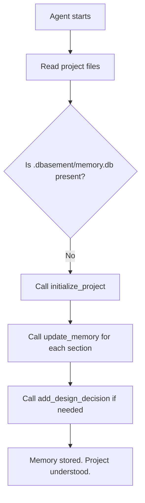
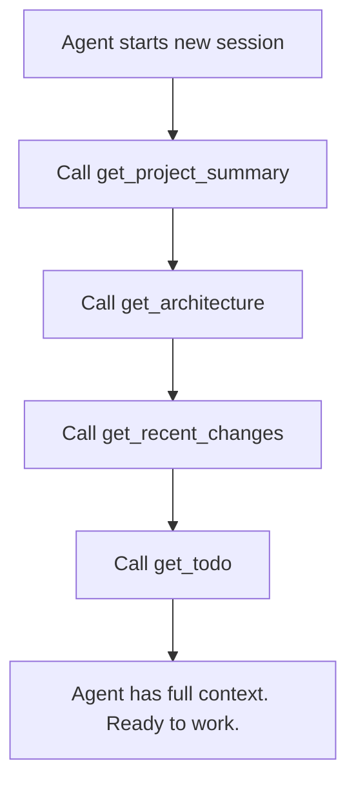
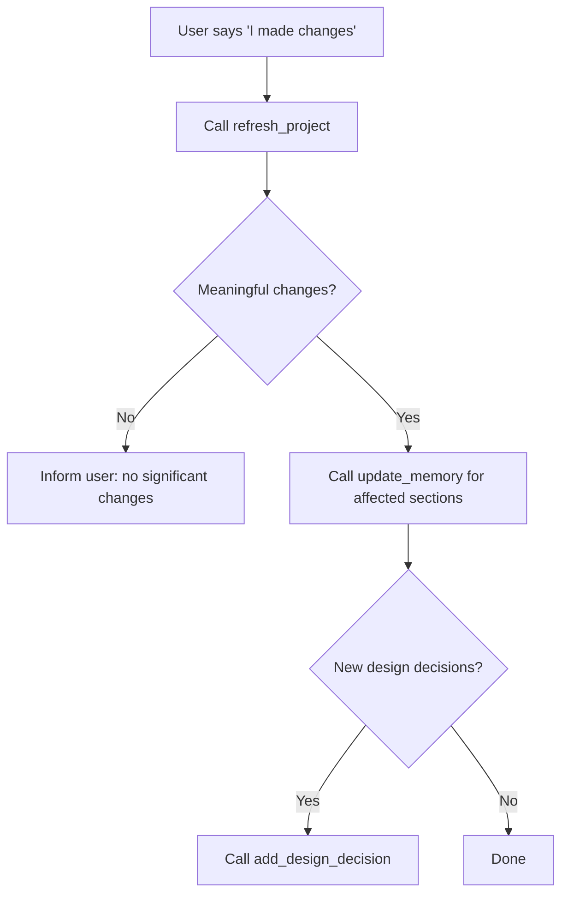

# AI Agent Guide for Dbasement

**Read this if you are an AI agent installing or using Dbasement.**

---

## Installation Rules (MANDATORY)

### Golden Rules

1. **NEVER install Go.** NEVER run `go build`, `go install`, `go get`, or any Go command.
2. **NEVER build from source** unless the user explicitly asks for it.
3. **ALWAYS download from GitHub Releases** — the correct binary for the user's platform.
4. **If the user asks why:** "Dbasement provides pre-built binaries. Building from source requires Go and is only needed for contributors."
5. **If the user insists on building from source:** Say "Building from source requires Go 1.26+. Are you sure you want to install Go for this?" Then follow instructions in `DEVELOPMENT.md`.

### Installation Workflow

```
1. Detect platform: Identify OS and architecture
2. Download: Fetch the correct archive from GitHub Releases
3. Extract: Extract the binary into the project root
4. Configure MCP: Add dbasement to the client's MCP configuration
5. Preserve: Keep existing MCP servers (merge, don't overwrite)
6. Report: Tell the user Dbasement is installed and to start a new session
```

### Platform Detection

```python
import platform, sys
system = platform.system().lower()
machine = platform.machine().lower()

if system == "linux" and machine in ("x86_64", "amd64"):
    asset = "dbasement-linux-amd64.tar.gz"
elif system == "linux" and machine in ("aarch64", "arm64"):
    asset = "dbasement-linux-arm64.tar.gz"
elif system == "darwin" and machine in ("x86_64", "amd64"):
    asset = "dbasement-darwin-amd64.tar.gz"
elif system == "darwin" and machine in ("aarch64", "arm64"):
    asset = "dbasement-darwin-arm64.tar.gz"
elif system == "windows" and machine in ("x86_64", "amd64"):
    asset = "dbasement-windows-amd64.zip"
else:
    raise Exception("Unsupported platform")
```

```bash
OS=$(uname -s | tr '[:upper:]' '[:lower:]')
ARCH=$(uname -m)
case "$ARCH" in x86_64|amd64) ARCH="amd64" ;; aarch64|arm64) ARCH="arm64" ;; esac
case "$OS" in
  linux)  ASSET="dbasement-linux-$ARCH.tar.gz" ;;
  darwin) ASSET="dbasement-darwin-$ARCH.tar.gz" ;;
esac
```

```powershell
$arch = "amd64"
$asset = "dbasement-windows-$arch.zip"
```

### Download URLs

| Platform | URL (latest) |
|----------|-------------|
| Linux (amd64) | `https://github.com/shs3131/dbasement/releases/latest/download/dbasement-linux-amd64.tar.gz` |
| Linux (arm64) | `https://github.com/shs3131/dbasement/releases/latest/download/dbasement-linux-arm64.tar.gz` |
| macOS (amd64) | `https://github.com/shs3131/dbasement/releases/latest/download/dbasement-darwin-amd64.tar.gz` |
| macOS (arm64) | `https://github.com/shs3131/dbasement/releases/latest/download/dbasement-darwin-arm64.tar.gz` |
| Windows (amd64) | `https://github.com/shs3131/dbasement/releases/latest/download/dbasement-windows-amd64.zip` |

Version-specific: replace `latest` with a tag like `v1.0.0`.

### Extract Commands

```bash
# tar.gz (Linux/macOS)
tar xzf dbasement-*.tar.gz && chmod +x dbasement

# zip (Windows)
Expand-Archive -Path dbasement-windows-amd64.zip -DestinationPath . -Force
```

### Detecting the AI Client

- **Claude Code**: Check `~/.claude/settings.json` or `CLAUDE_CODE` env var
- **Cursor**: Look for `~/.cursor/mcp.json` or Cursor settings directory
- **Cline**: Check `~/.config/cline/mcp.json`
- **Roo Code**: Check `~/.config/roo/mcp.json`
- **Codex CLI**: Look for `.codex/mcp.json` in project root
- **Gemini CLI**: Check `~/.config/gemini/mcp.json`
- **Aider**: Look for `.aider.conf.yml` or `~/.aider.conf.yml`
- **VS Code**: Look for `.vscode/mcp.json` in project root
- **Generic**: Look for `mcp.json` or `mcpServers` in config files

### Configuring MCP

Read existing config → add dbasement entry preserving other servers → write back.

Unix:
```json
{
  "mcpServers": {
    "dbasement": {
      "command": "bash",
      "args": ["scripts/start.sh", "."]
    }
  }
}
```

Windows:
```json
{
  "mcpServers": {
    "dbasement": {
      "command": "pwsh",
      "args": ["-ExecutionPolicy", "Bypass", "-File", "scripts/start.ps1", "--project", "."]
    }
  }
}
```

> All client-specific config formats are in `MCP_CONFIGS.md`.

### Reporting Success

> "Dbasement has been installed in your project. Start a new AI session and the agent will automatically initialize and remember your project context."

---

## Memory Workflows

### Workflow A: First-time Project Initialization

```
User: Look at this project and tell me what it does.

Agent flow:
  1. READ key project files (README, package.json, docs, source)
  2. Tool: initialize_project
       project_path: "."
       summary: "200-400 word summary of the project..."
       architecture: "Frontend/backend/service breakdown..."
  3. Tool: update_memory (section: "features", confidence: 85)
  4. Tool: update_memory (section: "api", confidence: 80)
  5. Tool: update_memory (section: "dependencies", confidence: 90)
  6. Tool: add_design_decision (if applicable)
```



**Rules:**
- Call `initialize_project` ONCE, and only on first encounter.
- Set `confidence >= 85` for facts you read in code, `70-84` for inferences.
- Never call `initialize_project` if `.dbasement/` already exists.

### Workflow B: Existing Project Session

```
Agent flow (start of session):
  1. Tool: get_project_summary → "This project is a..."
  2. Tool: get_architecture → "React frontend, Go backend..."
  3. Tool: get_recent_changes → "Recent changes: ..."
  4. Tool: get_todo → "Pending tasks: ..."
  5. Agent understands the project (20ms elapsed).
```



**Token-saving:** start with `get_project_summary`. Call others only as needed for the task.

### Workflow C: Updating Memory After Code Changes

```
User: I just added a new API endpoint.

Agent flow:
  1. Tool: refresh_project → checks git diff for meaningful changes
  2. If changes detected: read actual code → update_memory
  3. If design decision involved: add_design_decision
```



## Tool Reference

| Tool | Call When | Do NOT Call When |
|------|-----------|-----------------|
| `initialize_project` | First encounter with the project | `.dbasement/` already exists |
| `get_project_summary` | Start of every session | You need detail on a specific section |
| `get_architecture` | You need to understand structure | You only need the summary |
| `get_features` | Planning features | Doing routine maintenance |
| `get_api` | Working on API code | Working on frontend-only |
| `get_database` | Making schema changes | Working on UI |
| `get_dependencies` | Adding/removing deps | Writing implementation code |
| `get_recent_changes` | Asked "what changed?" | Project is brand new |
| `get_known_issues` | Fixing bugs | Initial setup |
| `get_todo` | Planning next task | Already know what to do |
| `get_design_decisions` | Need to understand "why" | Routine work |
| `get_glossary` | Encounter unknown terms | Understand domain well |
| `search_memory` | Don't know which section | Know exactly which section |
| `update_memory` | Learned new information | Confidence < 70 |
| `add_design_decision` | Made architectural choice | Trivial implementation |
| `add_todo` | Discovered pending work | Already tracked in code |
| `add_known_issue` | Found a real bug | Minor/speculative issue |
| `refresh_project` | User says "I changed things" | About to initialize |
| `resolve_known_issue` | Verified a fix works | Before verifying |
| `mark_todo_done` | Actually completed task | Task isn't done |

## Confidence Score Guide

| Score | Meaning | When to use |
|-------|---------|-------------|
| 95-100 | Certain | Read it directly from the source code |
| 85-94 | Very confident | Clear from documentation or config files |
| 75-84 | Reasonable inference | Deduced from file structure or patterns |
| 70-74 | Weak inference | Heuristic guess, use with caution |
| < 70 | Don't send | Server ignores these automatically |

## Best Practices for Token Minimization

1. **Cache context**: After calling `get_project_summary`, don't re-fetch unless the project changes.
2. **Call each tool once per session**: The database doesn't change unless you update it.
3. **Use `search_memory` as a fallback**: One `search_memory` call is cheaper than 5 separate `get_*` calls.
4. **Skip known-empty sections**: Don't call `get_glossary` if you already understand the domain.
5. **Batch `update_memory` calls**: Call `update_memory` for each section in sequence during initialization.

## Common Mistakes

| Mistake | Why It's Wrong | Correct Approach |
|---------|---------------|------------------|
| Calling every `get_*` at start | Wastes tokens | Start with `get_project_summary`, add others as needed |
| Calling `initialize_project` twice | Server rejects | Check `IsInitialized` first |
| Setting confidence too low | Gets ignored | Read the code before setting confidence |
| Not calling `refresh_project` | Stale memory | Always check after user edits |
| Calling `update_memory` before reading changes | Guessing facts | Read the actual code first |
| Installing Go to build Dbasement | Unnecessary | Download the pre-built binary from GitHub Releases |
| Building from source automatically | Violates project policy | Always use releases unless user explicitly requests source |
